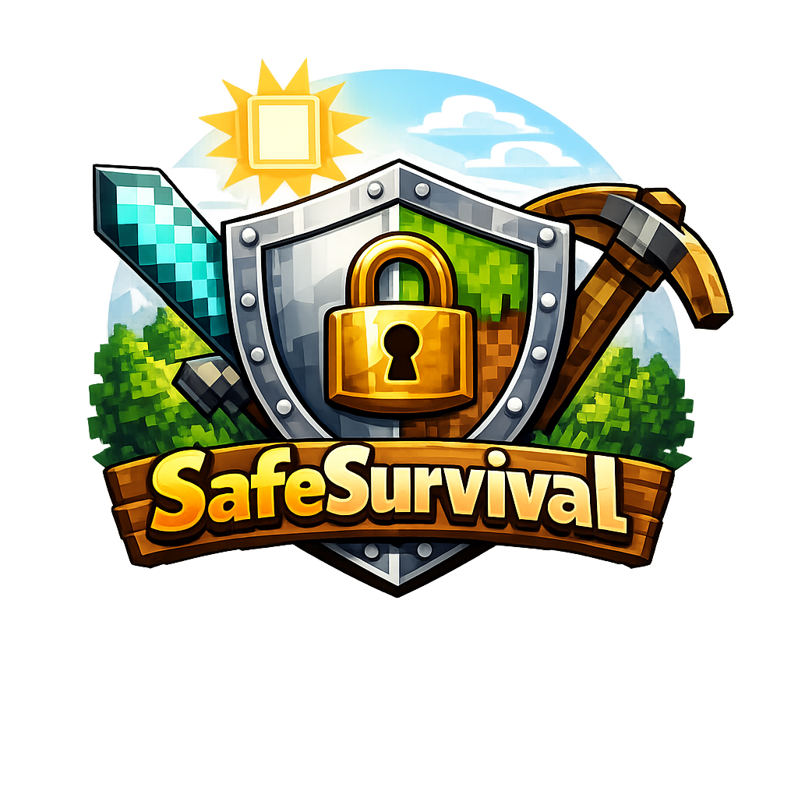

# 🛡️ SafeSurvival

**SafeSurvival** is a modern Paper plugin that prevents cheating on survival servers by blocking selected vanilla commands, even for OP players.

Designed for private SMPs and friend groups, it provides an easy-to-use configuration system with an in-game GUI.  

**Only v1.0 of SafeSurvival is fully compatible with any spigot/bukkit/paper version**

You can add **new commands from other plugins** in the config.yml file to block these commands too *(These new commands can now be visible in `/ss config` with SafeSurvival v1.0.5+)*

---

## 💎 Updating

When updating SafeSurvival to a new version, your `config.yml` may need to be updated.

Before updating:
1. Stop the server.
2. Delete the old `config.yml`.
3. Start the server, a new `config.yml` will be created.
4. Reconfigure settings if necessary.
5. Start the server again and enjoy.

*SafeSurvival v1.0.7+ will say if the config is outdated or not*

# ✨ Features

- 🚫 Block vanilla commands individually
- ⚙️ Fully configurable through `config.yml`
- 🖥️ In-game configuration GUI (`/ss config`)
- 👑 Blocks commands even for OP players
- 📢 Broadcasts attempted uses of blocked commands
- 🔒 Supports namespaced commands (`minecraft:`, `bukkit:`, `paper:`, ...)
- ⚡ Lightweight and optimized for Paper

---

# 📋 Supported Commands

SafeSurvival can block commands from many categories, including:

You can add new commands from other plugins in the config.yml file to block these commands too (These new commands can now be visible in `/ss config` with SafeSurvival v1.0.5+)

### Gamemode & Rules
- `/gamemode`
- `/defaultgamemode`
- `/gamerule`
- `/difficulty`

### Items & Entities
- `/give`
- `/item`
- `/summon`
- `/loot`
- `/clear`
- `/kill`
- `/effect`
- `/enchant`
- `/xp`
- `/experience`
- `/attribute`
- `/damage`

### Teleportation
- `/tp`
- `/teleport`
- `/spreadplayers`
- `/ride`
- `/spectate`

### World
- `/fill`
- `/setblock`
- `/clone`
- `/place`
- `/fillbiome`
- `/data`
- `/execute`
- `/function`
- `/forceload`
- `/worldborder`
- `/setworldspawn`
- `/spawnpoint`

### Time
- `/time`
- `/weather`
- `/tick`

### Information
- `/seed`
- `/locate`
- `/locatebiome`

### Player Data
- `/recipe`
- `/advancement`

### GUI
- `/title`
- `/tellraw`
- `/bossbar`
- `/playsound`

### Administration
- `/reload`
- `/stop`
- `/debug`
- `/perf`
- `/jfr`
- `/save-all`
- `/save-on`
- `/save-off`

### Permissions
- `/op`
- `/deop`

### Players
- `/kick`
- `/ban`
- `/ban-ip`
- `/pardon`
- `/pardon-ip`
- `/whitelist`

### Miscellaneous
- `/publish`
- `/trigger`

---

# ⚙️ Configuration

Every command can be enabled or disabled individually.

Example:

```yaml
commands:
  gamemode: true
  give: true
  teleport: false
```

- `true` → Command is blocked.
- `false` → Command is allowed.

You can also edit the configuration directly in-game using:

```text
/ss config
```

---

# 📢 Command Detection

When a blocked command is executed:

- The command is cancelled.
- A broadcast is sent to all online players.

Example:

```text
[SafeSurvival] yopytuuh tried this: /gamemode creative
```

---

# 📥 Installation

1. Download the latest release.
2. Place the `.jar` inside your server's `plugins` folder.
3. Start the server.
4. Configure the plugin with `/ss config` or by editing `config.yml`.
5. Enjoy a cheat-free survival experience.

---

# 💻 Requirements

- **Paper 26.1+ or newer**
- **Java 25 or newer**
- **Only v1.0 of SafeSurvival is fully compatible with any spigot/bukkit/paper version**

---

# 📌 Commands

| Command | Description |
|---------|-------------|
| `/ss config` | Opens the SafeSurvival configuration GUI. |*
| `/ss reload` | Reload plugin

---

# 📄 License

This project is licensed under the MIT License.